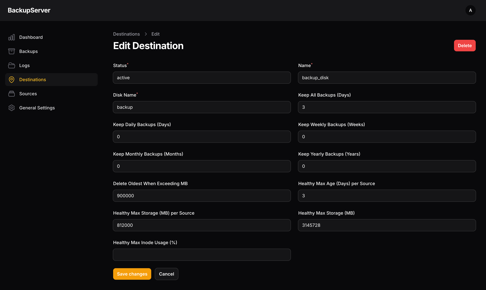
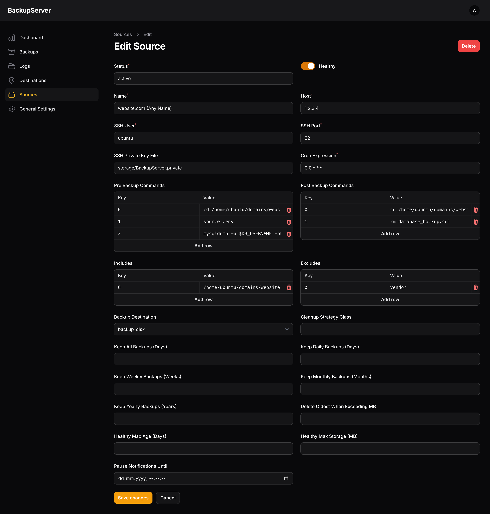
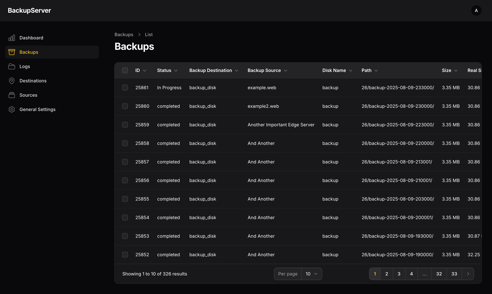
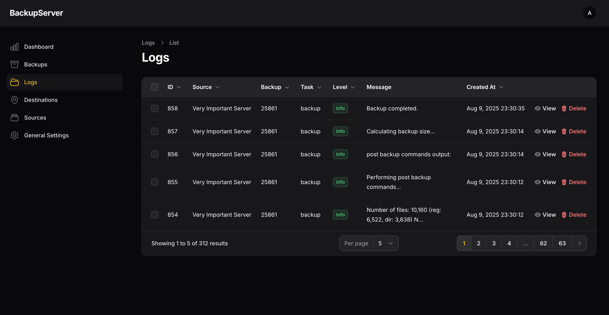

<div style="text-align: center"><h1>Ultimate Backup Server</h1></div>


This project aims to resolve issue that every company / developer has - Backups. I was not able to find backup solution
that fits all my needs, so I decided to build it myself.

By its nature, project is really simple but solves complex problems. It uses one of Spatie's packages, that was paid
some time ago, and now it's free (thanks, Spatie, for this!).

### Requirements

- rsync v3 or higher should be installed on both the source and destination of your backup
- the source and destination server should use the `ext3` or `ext4` filesystem
- Docker

### How it works?

You are interacting and setting up backup sources, destinations, settings etc. using admin panel (not CLI).

Imagine you have server that has 300 GB of files. At first backup, all 300 GB will be retrieved. On second run, when a
backup
contains files that are also present in a previous backup, deduplication using hard links will be performed. Even though
you will
see full backups in the filesystem, only changed files will take up disk space. But, you can retrieve files like you
would normally. This gives you unique possibility to have for example 10 versions of backup for 300 GB that might take
305 GB disk space.

This app also provides healt checks functionality for backups and notifies you as soon as health issues are detected.

### Application Setup (local)

1. Clone the repository and cd into it

2. Configure `.env`:

```bash
  docker run --rm \
      -u "$(id -u):$(id -g)" \
      -v "$(pwd):/var/www/html" \
      -w /var/www/html \
      alpine:latest \
      sh -c 'cp .env.example .env && \
      sed -i "s#^DB_DATABASE=#DB_DATABASE=laravel#g" .env && \
      sed -i "s#^DB_USERNAME=#DB_USERNAME=laravel#g" .env && \
      sed -i "s#^DB_PASSWORD=#DB_PASSWORD=password#g" .env && \
      sed -i "s#^APP_ENV=#APP_ENV=local#g" .env && \
      sed -i "s#^APP_URL=#APP_URL=http://localhost#g" .env && \
      sed -i "s#^APP_DEBUG=#APP_DEBUG=true#g" .env && \
      sed -i "s#^DB_HOST=#DB_HOST=mysql#g" .env && \
      sed -i "s#^APP_TIMEZONE=#APP_TIMEZONE=UTC#g" .env && \
      sed -i "s#^REDIS_HOST=#REDIS_HOST=redis#g" .env'
```

3. Install composer dependencies and set app key

```bash
docker run --rm \
    -u "$(id -u):$(id -g)" \
    -v "$(pwd):/var/www/html" \
    -w /var/www/html \
    laravelsail/php84-composer:latest \
    composer install --ignore-platform-reqs && \
    php artisan key:generate
```

4. Run Sail

```bash
./vendor/bin/sail up -d
```

5. Wait few seconds. Database needs to be created and initialized. Then run migrate

```bash
./vendor/bin/sail artisan migrate
```

6. Create admin user

```bash
./vendor/bin/sail artisan make:filament-user
```

Follow prompt and enter all details.

At this stage, app is up and running. You can go to `localhost` in browser and access it.

### Backup Server Configuration

Now, let's configure backup destinations, sources and configure backup schedule.

First, let's create destination. It is a place where all backups will be located. You might have multiple locations,
local or mounted. We will create one, in this example.

Go to Destinations -> New Destination and fill the form:



Let's explain each input individually:

1. Keep All Backups (Days) – Backups are retained in full for this many days before any pruning starts. For our example,
   this setting will save backups for last 3 days.
2. Keep Daily Backups (Days) – After the initial period, only one backup per day is retained, for this many days.
3. Keep Weekly Backups (Weeks) – After daily retention expires, one backup per week is kept for this many weeks.
4. Keep Monthly Backups (Months) – Afterwards, one backup per month is kept for this many months.
5. Keep Yearly Backups (Years) – Finally, one backup per year is kept for this many years.
6. Delete Oldest When Exceeding MB – Once all the retention rules are applied, the system continues deleting the oldest
   backups until total used space is below this threshold

!Important: The strategy will never delete the most recent backup, regardless of age or size

7. Healthy Max Age (Days) per Source – The source fails health check if the youngest backup is older than this.
8. Healthy Max Storage (MB) per Source – The source is considered unhealthy if the total size of backups exceeds this.
   These checks come from the SourceHealthCheck classes configured in monitor.source_health_checks

Other fields do not need explanation, I guess. You can copy and paste those as it is. The configuration on image will:

1. Save each source's backup for 3 days
2. Run health checks based on configuration provided above
3. Make sure total size of all backups do not exceed `3145728 MB`

Destination is ready to be used. Now, let's create a source:



You will notice some inputs have similar names as described before. This overrides destination rules per backup. But, we
don't need to do it in this example.

Other than those, we have:

1. SSH Private Key File - You will need to create private key, that will be used by server to connect to sources.
2. Cron Expression - If you need explanations here, forget this project.
3. Pre Backup Commands - Which commands will be run on source server, before backup procedure. In this example, I am
   creating
   backup of whole database in a secure place.
4. Post Backup Commands - You are right! Commands that will be executed after backup, on source server. Here, I am
   deleting backup created earlier.
5. Includes - Which folders should be included on source server
6. Backup Destination - Where backups should be saved
7. Cleanup Strategy Class - Cleanup strategies can be adjusted. You will need to enter classname for custom cleanup
   class, if needed.

Other fields are same or have descriptive names, so I will not go deep here.

At this point, everything is ready. Now, backup server is up and running. When backups are ready / in progress / failed,
you will see them in backups section:



As well as detailed logs for each backup process:



Do not forget to set notification email and enable backup server in General Settings.

### Security Recommendations

Backup server is not something that should be accessed by everyone. It's a service that you should trust and take
responsibility of it. Make sure only you can access the server and all other ip's are blocked (for example, UFW rule).

If you will setup github action that deploys the app, allow SSH port for a while and close it back after deployment. Or
setup secure deployment environment (e.g, through VPN).

### Production Guidelines

This part will be covered later on.
